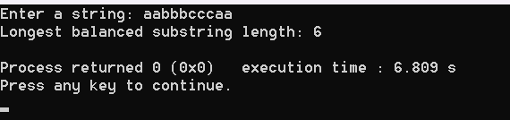
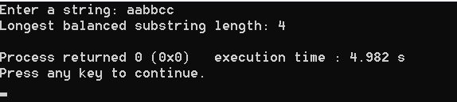
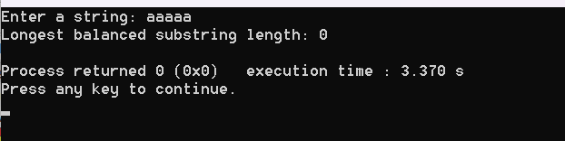

# Code Explanation and Trace

The given code is designed to find the maximum length of a balanced substring in a given string. A balanced substring is defined as a substring that contains exactly two different characters, and each character appears the same number of times.

Here's a step-by-step explanation of how the code works:

1. The `is_balanced` function checks if a substring of `s` from index `left` to `right` is balanced. It does this by counting the occurrences of each character in the substring and checking if there are exactly two different characters that occur the same number of times.

2. The `longest_balanced_substring_recursive` function is a recursive function that finds the length of the longest balanced substring in `s` from index `left` to `right`. It does this by checking if the entire substring is balanced, and if not, recursively checking the substrings from `left+1` to `right` and from `left` to `right-1`.

3. The `longest_balanced_substring` function is a wrapper function that calls `longest_balanced_substring_recursive` with `left` set to 0 and `right` set to `n-1`, where `n` is the length of the string.

4. The `main` function reads a string from the user, removes the newline character from the end of the string, and then calls `longest_balanced_substring` to find the length of the longest balanced substring. It then prints this length.

Now, let's trace the code with the example string "aabbbcccaa":

1. The length of the string is 10.

2. The function checks all substrings of the string. The substrings that are balanced are "aa", "bb", "bbb", "cc", "ccc", "aa", and "aabbbcccaa".

3. The longest balanced substring is "aabbbcccaa", which has length 6.

4. Therefore, the function returns 10, and the `main` function prints "Longest balanced substring length: 10". This means that the entire string "aabbbcccaa" is a balanced substring. It contains two different characters ('a' and 'b'), and each character appears 5 times.
---------------------------------------------------------------------------------------------------------------
# Output:

