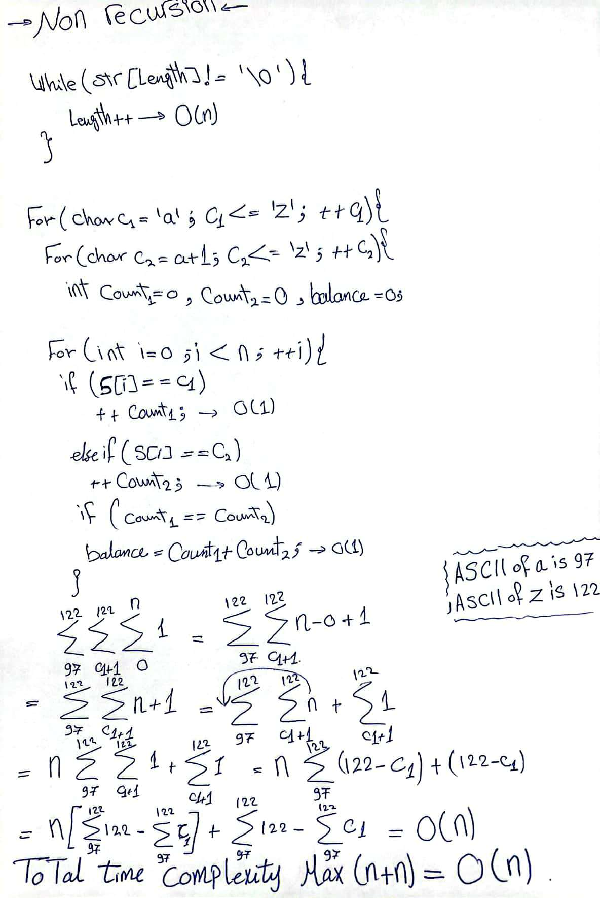

# Time Complexity Analysis

Consider the code which consists of three nested loops. The outer two loops iterate over the characters from 'a' to 'z', and the innermost loop iterates over the length of the string `S`, which is `n`.

1. The outermost loop runs 26 times (for each lowercase letter in the English alphabet).
2. The second loop runs on average about 13 times (half the number of letters in the alphabet), because it starts from `c1 + 1` and goes up to 'z'.
3. The innermost loop runs `n` times, where `n` is the length of the string `S`.

The time complexity of this code can be calculated using summation as follows:

$$T(n) = \sum_{c1='a'}^{c1='z'} \sum_{c2=c1+1}^{c2='z'} \sum_{i=0}^{i=n-1} O(1)$$

Here, `O(1)` represents the constant time operations inside the innermost loop (like the if conditions and increment operations).

This simplifies to:

$$T(n) = 26 * 13 * n * O(1) = O(n)$$

So, the time complexity of these loops is linear, or `O(n)`, in terms of the length of the string `S`. This means that the time taken by the code increases linearly with the size of the input string. However, because the loops also iterate over the characters of the alphabet, the actual number of operations is proportional to `n` times the square of the alphabet size. But in terms of big-O notation, which is used to describe the upper bound of the time complexity, the code is `O(n)`. This is because the size of the alphabet is a constant, and constants are ignored in big-O notation.

