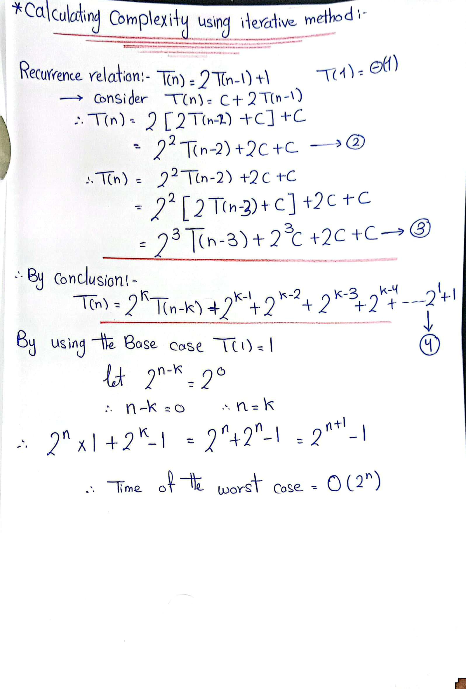
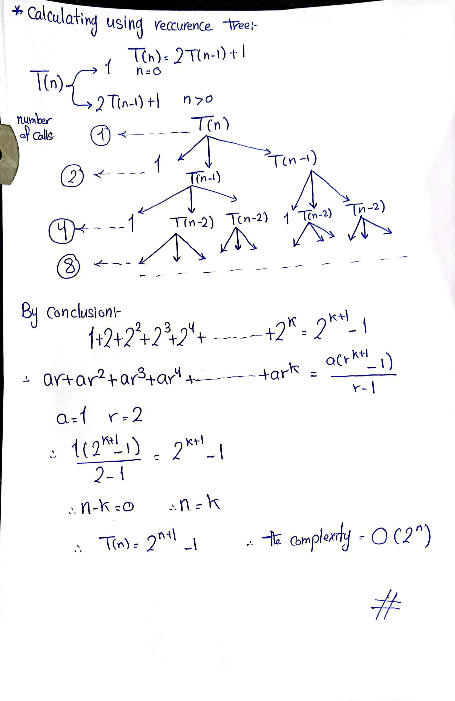

# Time Complexity Analysis using iterative method

Given the recurrence relation: 

$$T(n) = 2T(n-1) - 1$$

We can expand this as follows:

1. Substitute $$n$$ by $$n-1$$ in the equation to find the value of $$T(n-1)$$:

    $$T(n-1) = 2T(n-2) - 1$$

2. Similarly, we can find:

    $$T(n-2) = 2T(n-3) - 1$$
    $$T(n-3) = 2T(n-4) - 1$$

3. Now, substitute these equations back into the original equation:

    $$T(n) = 2[2T(n-2) - 1] - 1 = 4T(n-2) - 3$$
    $$T(n) = 4[2T(n-3) - 1] - 3 = 8T(n-3) - 7$$
    $$T(n) = 8[2T(n-4) - 1] - 7 = 16T(n-4) - 15$$

This can be generalized as:

$$T(n) = 2^k T(n-k) - (2^k - 1)$$

Assuming the value of $$T(n-1)$$ is reducing one by one, we can set $$n-k = 1$$, which gives $$n = k$$. Substituting this back into the equation gives:

$$T(n) = 2^n T(1) - (2^n - 1)$$

Therefore, the time complexity will be:

$$O(2^n * c - 2^n + 1) = O(2^n(c-1) + 1) = O(2^n)$$

So, the time complexity for the given recurrence relation is $$O(2^n)$$.

  

------------------------------------------------------------------------
# Time Complexity Analysis using recursive tree method
Consider the recurrence relation: 

$$T(n) = 2T(n-1) - 1$$

We can visualize this as a recursion tree:

                 T(n)   -> 1
                /   \
            T(n-1)  T(n-1) -> 2
            /   \    /   \
        T(n-2) T(n-2) T(n-2) T(n-2) -> 4
        /   \   /   \   /   \   /   \
      ...   ... ...   ... ...   ... ...   ... ->2^k

Each level of the tree has twice as many nodes as the previous level, and there are `n` levels in total (since we make `n` recursive calls before reaching the base case). Therefore, the total number of nodes in the tree is `2^n`.

Since each node corresponds to a constant amount of work (subtracting 1 from `n` and making two recursive calls), the total amount of work done is proportional to the number of nodes in the tree. Therefore, the time complexity of the function is `O(2^n)`.

This matches the result we obtained from the expansion method. Both methods show that the time complexity of the function is exponential in `n`. This means that the time taken by the function grows very quickly as `n` increases. In practical terms, this function would be very slow for large inputs.

  
